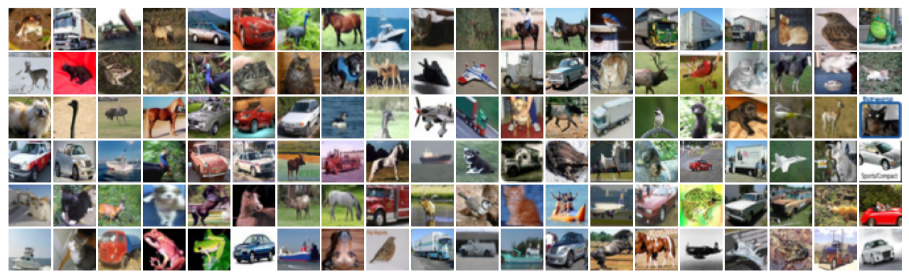

# 🌌 CIFAR-10 Image Classification using CNNs
 

## 🌐 Overview
The __CIFAR-10__ dataset stands as a beacon in machine learning and image classification. Consisting of __60,000 vivid color images__ with dimensions of __32x32 pixels__, it encapsulates the vibrant spectrum of everyday objects and creatures, subdivided into __10 distinct classes__: 

- Airplane
- Automobile
- Bird
- Cat
- Deer
- Dog
- Frog
- Horse
- Ship
- Truck

Each category is uniformly distributed, holding 6,000 images each. Of the entire dataset, 50,000 images are earmarked for training, leaving the remaining 10,000 for testing. Through this project, our mission is to craft and educate a Convolutional Neural Network (CNN) that showcases adept classification proficiency on this diverse dataset.

## 🌟 Key Features 
- 🎨 In-depth exploration and understanding of the CIFAR-10 dataset.
- 🔄 Comprehensive data preprocessing techniques including normalization and one-hot encoding.
- 🎛 Implementation of data augmentation techniques to promote model generalization.
- 🏗 Architectural design of a CNN tailored for CIFAR-10 using Keras.
- ⚖ Mechanisms such as dropout and regularization to mitigate overfitting.
- 📈 Dynamic learning rate adjustment and early stopping during model training.
- 📊 Learning analysis via visualization of model performance metrics over epochs.
- 💡 Evaluation of the model's real-world applicability through testing on non-dataset images.

## 📁 File Descriptions

- 📓 **`CIFAR-10_Image_Classification_with_CNN.ipynb`**: The primary Jupyter notebook encapsulating all code, explanations, and results for this project.
- 📘 **`README.md`**: The file you're currently reading, offering an extensive overview and useful insights regarding the project.

## 🚀 Instructions for Local Execution

1. **Clone this Repository**: Begin by cloning this repository to your local setup.
2. **Open the Notebook**: Access the `CIFAR-10_Image_Classification_with_CNN.ipynb` in Jupyter.
3. **Install Dependencies**: Ensure all necessary Python libraries are installed for seamless execution.
4. **Execution**: Run all cells in the notebook to witness the results and insights.

## 🔗 Additional Resources

- 🌐 **Kaggle Notebook**: If you're keen on a Kaggle environment, delve into the notebook [here](https://www.kaggle.com/farzadnekouei/code).  
- 🤝 **Connect on LinkedIn**: Have queries or looking for collaborations? Feel free to connect on [LinkedIn](https://www.linkedin.com/in/farzad-nekouei-7535aa53/). 
